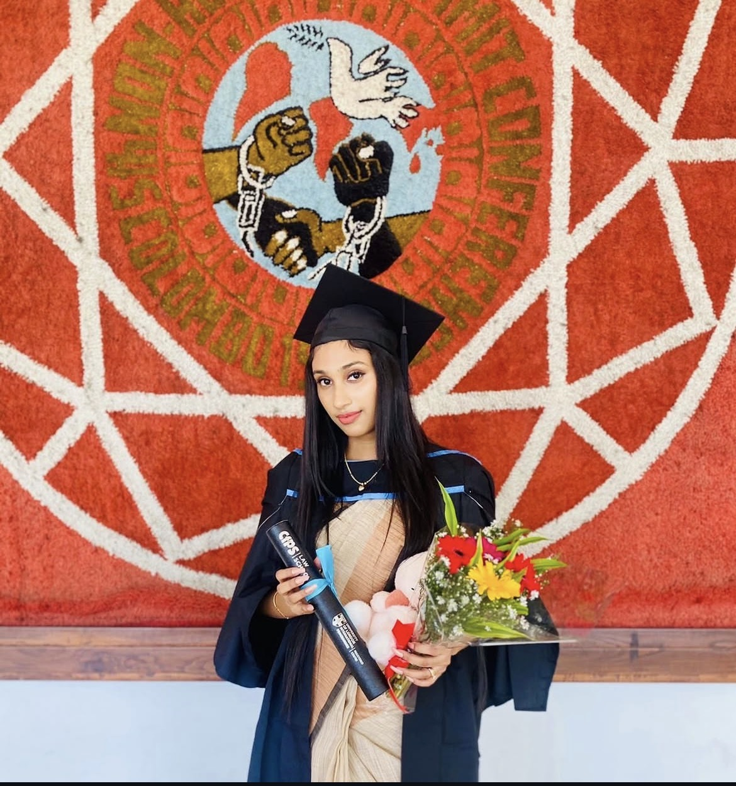

# Roshan Shifna Niyas

{width=300px}

## MBA Candidate | Banking & Customer Service Professional

I am an MBA candidate at University Canada West with experience in banking, finance support, and customer service. My professional focus is on building a career in the banking and financial services sector.

---

## What I Do

I bring together business knowledge, financial accuracy, and strong customer communication. My background in banking and finance support has helped me develop attention to detail, reliability, and professional service skills.

---

## Quick Highlights

- MBA Candidate – University Canada West
- Banking experience – Sampath Bank PLC
- Finance support experience – Accounts Assistant
- Legal research background
- Strong communication and teamwork